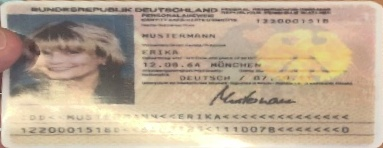

# 進階設定

調用 `DocAligner` 模型時，你可以透過傳遞參數來進行進階設定。

## Initialization

以下是在初始化階段的進階設定選項：

### 1. Backend

Backend 是一個列舉類型，用於指定 `DocAligner` 的運算後端。

它包含以下選項：
- **cpu**：使用 CPU 進行運算。
- **cuda**：使用 GPU 進行運算（需要適當的硬體支援）。


```python
from docsaidkit import Backend

model = DocAligner(backend=Backend.cuda) # 使用 CUDA 後端
#
# 或是
#
model = DocAligner(backend=Backend.cpu) # 使用 CPU 後端
```

我們是使用 ONNXRuntime 作為模型的推論引擎，雖然 ONNXRuntime 支援了多種後端引擎（包括 CPU、CUDA、OpenCL、DirectX、TensorRT 等等），但限於平常使用的環境，我們稍微做了一點封裝，目前只提供了 CPU 和 CUDA 兩種後端引擎。此外，使用 cuda 運算除了需要適當的硬體支援外，還需要安裝相應的 CUDA 驅動程式和 CUDA 工具包。

如果你的系統中沒有安裝 CUDA，或安裝的版本不正確，則無法使用 CUDA 運算後端。

:::tip
1. 如果你有其他需求，請參考 [**ONNXRuntime 官方文件**](https://onnxruntime.ai/docs/execution-providers/index.html) 進行自定義。
2. 關於安裝依賴相關的問題，請參考 [**ONNXRuntime Release Notes**](https://onnxruntime.ai/docs/execution-providers/CUDA-ExecutionProvider.html#requirements)
:::

### 2. ModelType

ModelType 是一個列舉類型，用於指定 `DocAligner` 使用的模型類型。

它包含以下選項：
- **heatmap**：使用熱圖模型。
- **point**：使用點回歸模型。

我們提供了兩種不同的模型：「熱圖模型」和「點回歸模型」。

你可以透過 `model_type` 參數來指定使用的模型。

```python
from docaligner import ModelType

model = DocAligner(model_type=ModelType.heatmap) # 使用熱圖模型
#
# 或是
#
model = DocAligner(model_type=ModelType.point) # 使用點回歸模型
```

:::tip
話是這樣講，但不建議用『點回歸』模型，因為它的效果不太好，這個純粹為了研究用的。
:::

### 3. ModelCfg

我們訓練了很多模型，並且幫它們取了名字，

你可以透過 `list_models` 來查看所有可用的模型。

```python
from docaligner import DocAligner

print(DocAligner().list_models())
# >>> [
#     'lcnet050',
#     'lcnet050_fpn',
#     'lcnet100',
#     'lcnet100_fpn',
#     'mobilenetv2_140',
#     'fastvit_t8',
#     'fastvit_sa24',       <-- Default
#     ...
# ]
```

你可以透過 `model_cfg` 參數來指定模型的配置。

```python
model = DocAligner(model_cfg='mobilenetv2_140') # 使用 'mobilenetv2_140' 配置
```

## Inference

以下是在推論階段的進階設定選項：

### CenterCrop

在進行推論階段，設定適當的進階選項能夠顯著影響模型的表現和效果。

其中，`do_center_crop`是一個關鍵的參數，它決定是否在推論時進行中心裁剪。

這項設定尤其重要，因為在實際應用中，我們遇到的圖像往往並非標準的正方形尺寸。

實際上，圖像的尺寸和比例多種多樣，例如：
- 手機拍攝的照片普遍採用 9:16 的寬高比；
- 掃描的文件常見於 A4 的紙張比例；
- 網頁截圖大多是 16:9 的寬高比；
- 透過 webcam 拍攝的圖片，則通常是 4:3 的比例。

這些非正方形的圖像，在不經過適當處理直接進行推論時，往往會包含大量的無關區域或空白，從而對模型的推論效果產生不利影響。進行中心裁剪能夠有效減少這些無關區域，專注於圖像的中心區域，從而提高推論的準確性和效率。

使用方式如下：

```python
import docsaidkit as D
from docaligner import DocAligner

model = DocAligner()

img = D.imread('path/to/image.jpg')
result = model(img, do_center_crop=True) # 使用中心裁剪
```

:::tip
**使用時機**：『不會切到圖片』且圖片比例不是正方形時，可以使用中心裁切。
:::warning
中心裁減只是在計算流程中的一個步驟，不會對原始圖像進行修改。最後得到的結果會映射回原始圖像的尺寸，使用者不須擔心圖像的變形或失真問題。
:::
:::


### Return `Document` Object

使用 `return_document_obj` 參數可以指定是否返回 [**Document**](../docsaidkit/funcs/objects/document) 物件。

在很多時候，你可能只需要文件的多邊形資訊，而不需要其他的屬性。

這時，你可以設定 `return_document_obj=False`，這樣就只會返回多邊形資訊。

```python
result = model(img)
print(type(result))
# >>> <class 'docsaidkit.funcs.objects.document.Document'>

# 或是

result = model(img, return_document_obj=False) # 只返回多邊形資訊
print(type(result))
# >>> <class 'numpy.ndarray'>

print(result)
# >>> array([[ 48.151894, 223.47687 ],
#            [387.1344  , 198.09961 ],
#            [423.0362  , 345.51334 ],
#            [ 40.148613, 361.38782 ]], dtype=float32)
```

:::tip
當你取得 `numpy.ndarray` 時，你可以調用 [**Docsaidkit.imwarp_quadrangle**](../docsaidkit/funcs/vision/geometric/imwarp_quadrangle) 函數來進行進一步的後處理，參考範例：

```python
import docsaidkit as D

result = model(img, return_document_obj=False)
flat_doc_img = D.imwarp_quadrangle(img, result)
```

輸出結果如下：



:::warning
**注意**：函數 [**Docsaidkit.imwarp_quadrangle**](../docsaidkit/funcs/vision/geometric/imwarp_quadrangle) 沒有支援指定文件大小，因此輸出的圖片尺寸會根據多邊形的『最小旋轉外接矩形』來決定。
:::
:::