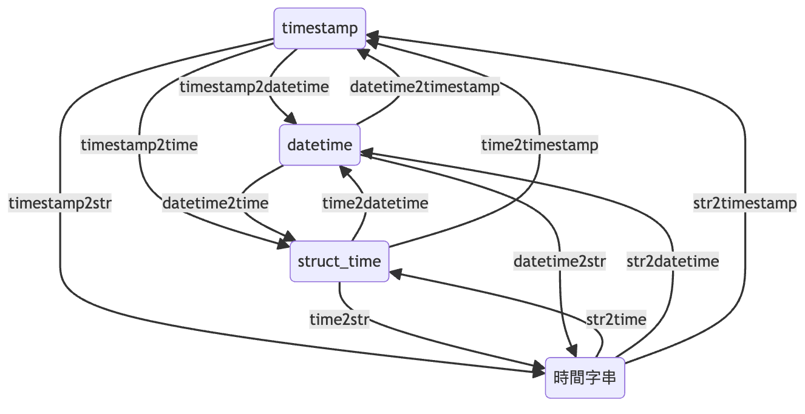

# Time2Time

在 Python 中，多個不同時間套件的轉換一直都是個惱人的問題。之前我也被煩過，所以就寫了幾個轉換函數來解決這個問題。這些函數可以讓你在 `datetime`、`struct_time`、`timestamp` 和`時間字串`之間自由轉換。

我先畫個圖給你看看這些函數之間的關係：



如果你好奇上面那張圖是怎麼畫出來的，可以參考下面的 Mermaid 程式碼：

```mermaid
graph TD
    timestamp(timestamp)
    struct_time(struct_time)
    datetime(datetime)
    str(時間字串)

    timestamp -->|timestamp2datetime| datetime
    timestamp -->|timestamp2time| struct_time
    timestamp -->|timestamp2str| str

    struct_time -->|time2datetime| datetime
    struct_time -->|time2timestamp| timestamp
    struct_time -->|time2str| str

    datetime -->|datetime2time| struct_time
    datetime -->|datetime2timestamp| timestamp
    datetime -->|datetime2str| str

    str -->|str2time| struct_time
    str -->|str2datetime| datetime
    str -->|str2timestamp| timestamp
```

看圖說故事，先找到你需要的轉換函數之後，再往下找：

---

## timestamp2datetime

>[timestamp2datetime(ts: Union[int, float]) -> datetime](https://github.com/DocsaidLab/DocsaidKit/blob/012540eebaebb2718987dd3ec0f7dcf40f403caa/docsaidkit/utils/time.py#L188)

- **說明**：將時間戳轉換為 `datetime`。

- **參數**
    - **ts** (`Union[int, float]`)：時間戳。

- **傳回值**
    - **datetime**：`datetime`。

- **範例**

    ```python
    import docsaidkit as D

    ts = 1634025600
    dt = D.timestamp2datetime(ts)
    print(dt)
    # >>> 2021-10-12 16:00:00
    ```

## timestamp2time

>[timestamp2time(ts: Union[int, float]) -> struct_time](https://github.com/DocsaidLab/DocsaidKit/blob/012540eebaebb2718987dd3ec0f7dcf40f403caa/docsaidkit/utils/time.py#L192)

- **說明**：將時間戳轉換為 `struct_time`。

- **參數**
    - **ts** (`Union[int, float]`)：時間戳。

- **傳回值**
    - **struct_time**：`struct_time`。

- **範例**

    ```python
    import docsaidkit as D

    ts = 1634025600
    t = D.timestamp2time(ts)
    print(t)
    # >>> time.struct_time(tm_year=2021, tm_mon=10, tm_mday=12, tm_hour=16, tm_min=0, tm_sec=0, tm_wday=1, tm_yday=285, tm_isdst=0)
    ```

## timestamp2str

>[timestamp2str(ts: Union[int, float], fmt: str) -> str](https://github.com/DocsaidLab/DocsaidKit/blob/012540eebaebb2718987dd3ec0f7dcf40f403caa/docsaidkit/utils/time.py#L196)

- **說明**：將時間戳轉換為時間字串。

- **參數**
    - **ts** (`Union[int, float]`)：時間戳。
    - **fmt** (`str`)：時間格式。

- **傳回值**
    - **str**：時間字串。

- **範例**

    ```python
    import docsaidkit as D

    ts = 1634025600
    s = D.timestamp2str(ts, fmt='%Y-%m-%d %H:%M:%S')
    print(s)
    # >>> '2021-10-12 16:00:00'
    ```

## time2datetime

>[time2datetime(t: struct_time) -> datetime](https://github.com/DocsaidLab/DocsaidKit/blob/012540eebaebb2718987dd3ec0f7dcf40f403caa/docsaidkit/utils/time.py#L200)

- **說明**：將 `struct_time` 轉換為 `datetime`。

- **參數**
    - **t** (`struct_time`)：`struct_time`。

- **傳回值**

    - **datetime**：`datetime`。

- **範例**

    ```python
    import docsaidkit as D

    ts = 1634025600
    t = D.timestamp2time(ts)
    dt = D.time2datetime(t)
    print(dt)
    # >>> datetime.datetime(2021, 10, 12, 16, 0)
    ```

## time2timestamp

>[time2timestamp(t: struct_time) -> float](https://github.com/DocsaidLab/DocsaidKit/blob/012540eebaebb2718987dd3ec0f7dcf40f403caa/docsaidkit/utils/time.py#L206)

- **說明**：將 `struct_time` 轉換為時間戳。

- **參數**
    - **t** (`struct_time`)：`struct_time`。

- **傳回值**

    - **float**：時間戳。

- **範例**

    ```python
    import docsaidkit as D

    ts = 1634025600
    t = D.timestamp2time(ts)
    ts = D.time2timestamp(t)
    print(ts)
    # >>> 1634025600.0
    ```

## time2str

>[time2str(t: struct_time, fmt: str) -> str](https://github.com/DocsaidLab/DocsaidKit/blob/012540eebaebb2718987dd3ec0f7dcf40f403caa/docsaidkit/utils/time.py#L212)

- **說明**：將 `struct_time` 轉換為時間字串。

- **參數**
    - **t** (`struct_time`)：`struct_time`。
    - **fmt** (`str`)：時間格式。

- **傳回值**
    - **str**：時間字串。

- **範例**

    ```python
    import docsaidkit as D

    ts = 1634025600
    t = D.timestamp2time(ts)
    s = D.time2str(t, fmt='%Y-%m-%d %H:%M:%S')
    print(s)
    # >>> '2021-10-12 16:00:00'
    ```

## datetime2time

>[datetime2time(dt: datetime) -> struct_time](https://github.com/DocsaidLab/DocsaidKit/blob/012540eebaebb2718987dd3ec0f7dcf40f403caa/docsaidkit/utils/time.py#L218)

- **說明**：將 `datetime` 轉換為 `struct_time`。

- **參數**
    - **dt** (`datetime`)：`datetime`。

- **傳回值**
    - **struct_time**：`struct_time`。

- **範例**

    ```python
    import docsaidkit as D

    ts = 1634025600
    dt = D.timestamp2datetime(ts)
    t = D.datetime2time(dt)
    print(t)
    # >>> time.struct_time(tm_year=2021, tm_mon=10, tm_mday=12, tm_hour=16, tm_min=0, tm_sec=0, tm_wday=1, tm_yday=285, tm_isdst=-1)
    ```

## datetime2timestamp

>[datetime2timestamp(dt: datetime) -> float](https://github.com/DocsaidLab/DocsaidKit/blob/012540eebaebb2718987dd3ec0f7dcf40f403caa/docsaidkit/utils/time.py#L224)

- **說明**：將 `datetime` 轉換為時間戳。

- **參數**
    - **dt** (`datetime`)：`datetime`。

- **傳回值**
    - **float**：時間戳。

- **範例**

    ```python
    import docsaidkit as D

    ts = 1634025600
    dt = D.timestamp2datetime(ts)
    ts = D.datetime2timestamp(dt)
    print(ts)
    # >>> 1634025600.0
    ```

## datetime2str

>[datetime2str(dt: datetime, fmt: str) -> str](https://github.com/DocsaidLab/DocsaidKit/blob/012540eebaebb2718987dd3ec0f7dcf40f403caa/docsaidkit/utils/time.py#L230)

- **說明**：將 `datetime` 轉換為時間字串。

- **參數**
    - **dt** (`datetime`)：`datetime`。
    - **fmt** (`str`)：時間格式。

- **傳回值**

    - **str**：時間字串。

- **範例**

    ```python
    import docsaidkit as D

    ts = 1634025600
    dt = D.timestamp2datetime(ts)
    s = D.datetime2str(dt, fmt='%Y-%m-%d %H:%M:%S')
    print(s)
    # >>> '2021-10-12 16:00:00'
    ```

## str2time

>[str2time(s: str, fmt: str) -> struct_time](https://github.com/DocsaidLab/DocsaidKit/blob/012540eebaebb2718987dd3ec0f7dcf40f403caa/docsaidkit/utils/time.py#L236)

- **說明**：將時間字串轉換為 `struct_time`。

- **參數**
    - **s** (`str`)：時間字串。
    - **fmt** (`str`)：時間格式。

- **傳回值**

    - **struct_time**：`struct_time`。

- **範例**

    ```python
    import docsaidkit as D

    s = '2021-10-12 16:00:00'
    t = D.str2time(s, fmt='%Y-%m-%d %H:%M:%S')
    print(t)
    # >>> time.struct_time(tm_year=2021, tm_mon=10, tm_mday=12, tm_hour=16, tm_min=0, tm_sec=0, tm_wday=1, tm_yday=285, tm_isdst=-1)
    ```

## str2datetime

>[str2datetime(s: str, fmt: str) -> datetime](https://github.com/DocsaidLab/DocsaidKit/blob/012540eebaebb2718987dd3ec0f7dcf40f403caa/docsaidkit/utils/time.py#L242)

- **說明**：將時間字串轉換為 `datetime`。

- **參數**
    - **s** (`str`)：時間字串。
    - **fmt** (`str`)：時間格式。

- **傳回值**

    - **datetime**：`datetime`。

- **範例**

    ```python
    import docsaidkit as D

    s = '2021-10-12 16:00:00'
    dt = D.str2datetime(s, fmt='%Y-%m-%d %H:%M:%S')
    print(dt)
    # >>> datetime.datetime(2021, 10, 12, 16, 0)
    ```

## str2timestamp

>[str2timestamp(s: str, fmt: str) -> float](https://github.com/DocsaidLab/DocsaidKit/blob/012540eebaebb2718987dd3ec0f7dcf40f403caa/docsaidkit/utils/time.py#L248)

- **說明**：將時間字串轉換為時間戳。

- **參數**
    - **s** (`str`)：時間字串。
    - **fmt** (`str`)：時間格式。

- **傳回值**

    - **float**：時間戳。

- **範例**

    ```python
    import docsaidkit as D

    s = '2021-10-12 16:00:00'
    ts = D.str2timestamp(s, fmt='%Y-%m-%d %H:%M:%S')
    print(ts)
    # >>> 1634025600.0
    ```

