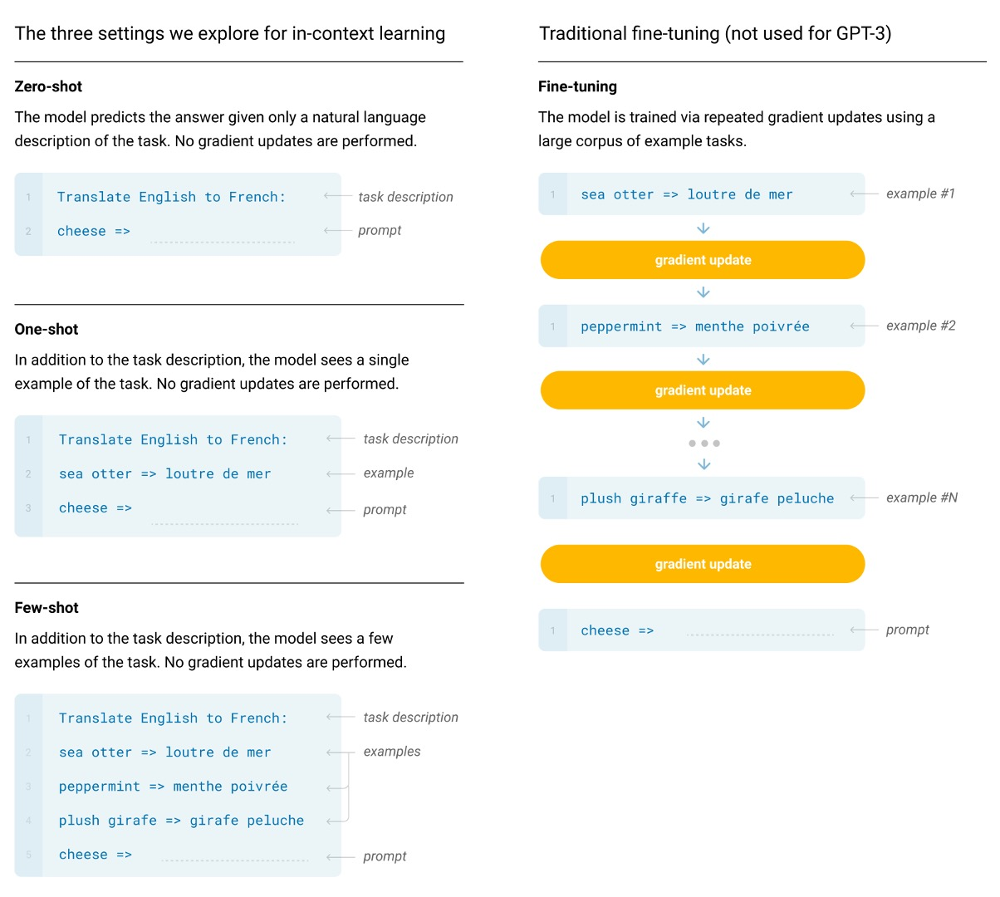

# [20.05] GPT-3

## 九十六層解碼器

[**Language Models are Few-Shot Learners**](https://arxiv.org/abs/2005.14165)

---

:::info
以下內容由 ChatGPT-4 彙整，並經過人工校對編輯與補充說明。
:::

---

第二代的 GPT 疊了四十八層 Transformer 解碼器。

OpenAI 覺得這樣不夠，於是他們繼續往上疊了九十六層 Transformer 解碼器，參數量達到史無前例的 175 B，名為 GPT-3。

## 定義問題

最近的工作已經證明，透過對大量文字進行預訓練，然後對特定任務進行微調，在許多 NLP 任務和基準測試中取得了巨大的成果。在我們的理想中的 NLP 技術應能像人類一樣，在接收少量指示或示例的情況下，快速適應和處理多種語言任務，但現階段的研究中還是有幾個問題，顯然和理想上還有很大的差距：

### 多樣化的語言任務需求

當前的語言模型面臨著適應廣泛且多樣化的語言任務的需求，從語法糾正到抽象概念生成等。每個新任務通常需要大量特定的標記數據集，這限制了模型的普遍適用性。

### 依賴大規模監督數據集

收集和標記大型數據集對於許多語言任務來說既昂貴又耗時。每個新任務都需要重複這一數據收集過程，這增加了開發成本並延長了部署時間。

### 模型的過度專業化和泛化問題

當前模型在特定任務上進行微調可能導致過度專業化，使得模型在訓練分佈之外的數據上泛化能力差。訓練中的虛假相關性可能會誤導模型，影響其長期和廣泛的應用。

### 人類的學習效率與模型的對比

相對於人類通過少量示例或直接指令就能快速適應新任務的能力，當前模型對大量標記數據的依賴顯得效率低下。

## 解決問題

在 GPT-3 中，基本預訓練方法，包括模型、資料和訓練，都與 GPT-2 中描述的過程類似，相對簡單地擴大了模型大小、資料集大小和多樣性以及訓練長度。對情境學習的使用也與 GPT-2 類似，但在這項工作中，作者們系統地探索了情境中學習的不同設定，主要的分別為：

1. **Fine-tuning**

   - 這是最常見的方法，涉及透過對特定於所需任務的監督資料集進行訓練來更新預訓練模型的權重。通常使用數千到數十萬個標籤的範例。微調的主要優點是在許多基準測試中表現出色。主要缺點是每個任務都需要一個新的大型資料集，分佈外泛化能力差的可能性，以及利用訓練資料的虛假特徵的可能性，這可能會導致與人類表現進行不公平的比較。在這項工作中，作者們沒有對 GPT-3 進行微調，因為他們的重點是與任務無關的性能，但 GPT-3 原則上可以進行微調，這是未來工作的一個有希望的方向。

2. **Few-shot**

   - Few-shot 是作者們在這項工作中使用的術語，指的是這樣的設定：在推理時為模型提供一些任務演示作為條件，但不允許權重更新。對於典型的資料集，範例具有上下文和所需的完成（例如英語句子和法語翻譯），透過給出 K 個上下文和完成的範例，然後提供一個最終範例，可以進行少樣本工作上下文，模型有望提供完成。作者們通常將 K 設定在 10 到 100 的範圍內，因為這是模型上下文視窗中可以容納的範例數量。Few-shot 的主要優點是大幅減少了對特定任務資料的需求，並降低了從大而窄的微調資料集中學習過於狹窄的分佈的潛力。主要缺點是，迄今為止，這種方法的結果比最先進的微調模型要差得多。此外，仍需要少量任務特定資料。

3. **One-shot**

   - One-shot 與 Few-shot 相同，只是只允許進行一次演示，此外還需要對任務進行自然語言描述。這種方法提供了最接近某些任務與人類溝通的方式。例如，當要求人類在人類工作者服務（例如 Mechanical Turk）上產生資料集時，通常會給出一個任務演示。相較之下，如果不給予範例，有時很難傳達任務的內容或格式。

4. **Zero-shot**

   - 與 One-shot 相同，只是不允許進行演示，並且僅向模型提供描述任務的自然語言指令。這種方法提供了最大的便利性、穩健性的潛力，並避免了虛假相關性，但也是最具挑戰性的設定。在某些情況下，如果沒有先前的範例，人類甚至可能很難理解任務的格式，因此這種設定在某些情況下「相當困難」。

### 模型架構

在本文中，作者使用與 GPT-2 相同的模型和架構，包括修改後的初始化、預歸一化和可逆標記化。

不同之處在於作者們在變壓器中使用了稀疏變壓器，讀者可以參考以下論文以獲取更多資訊：

- [**Generating Long Sequences with Sparse Transformers**](https://arxiv.org/pdf/1904.10509)

為了研究機器學習效能對模型大小的依賴性，作者們訓練了 8 種不同大小的模型，範圍從 1.25 億個參數到 1750 億個參數三個數量級，最後一個是他們稱為 GPT-3 的模型。

從上表中可以看到，所有模型都使用 2048 個 Token 的上下文視窗。作者們沿著深度和寬度維度跨 GPU 劃分模型，以最大程度地減少節點之間的資料傳輸。每個模型的精確架構參數是根據運算效率和跨 GPU 模型佈局的負載平衡來選擇的。

### 資料集設定

在本文中，作者使用包含近兆字的 Common Crawl 資料集來預先訓練模型。

另外，作者也發現未經篩選或僅輕度篩選的 Common Crawl 版本的資料品質通常不如精心準備的資料集。

為了提升資料集的平均質量，他們採取了以下三個步驟：

1. **資料篩選和品質控制**：篩選 Common Crawl 的數據，選擇與一系列高品質參考語料庫相似度較高的數據。
2. **去重處理**：在文件層級進行模糊重複資料刪除，既在資料集內部進行，也跨資料集進行，以防止資料冗餘，並保持驗證集的完整性。
3. **增強資料多樣性**：在訓練組合中加入了已知的高品質參考語料庫，以增強 Common Crawl 資料並提高其多樣性。

透過這種方法，作者收集了從 2016 年至 2019 年間的 41 個 Common Crawl 每月資料片段，這些資料包含了過濾前的 45TB 壓縮明文和過濾後的 570GB，大約等同於 4000 億個位元組編碼的 Token。

此外，在訓練期間並非按資料大小進行採樣，而是更頻繁地採樣我們認為品質較高的資料集，例如 Common Crawl 和 Books2 資料集在訓練期間的採樣次數不足一次，而其他數據集則採樣 2 至 3 次。這種做法本質上是為了用少量的過度擬合換取更高品質的訓練資料。

預訓練大規模網路資料的語言模型存在一個主要的方法論問題，尤其是對於那些能夠記憶大量內容的大型模型：在預訓練期間無意中看到測試或開發集，可能會污染下游任務的效果。為了減少這種污染，作者搜尋並嘗試消除所有 Benchmark 和 Training 資料的任何重疊。

不幸的是，過濾中的錯誤導致作者們忽略了一些重疊，而由於訓練成本，模型不能重新訓練，只能在後面試著挽救這個錯誤。

:::tip
訓練的機會是有限的，因為沒錢了。
:::

## 討論

## 結論

<!-- 這個模型的規模之大，以至於 OpenAI 在發布時擔心它可能被濫用，因此他們決定不公開釋出完整的模型。 -->
