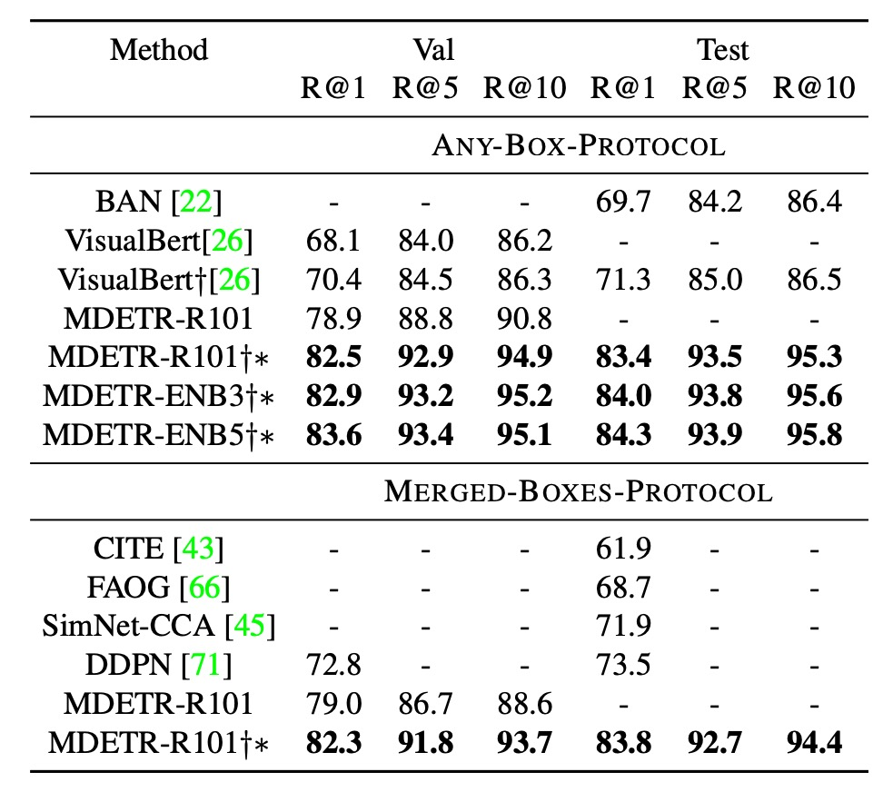
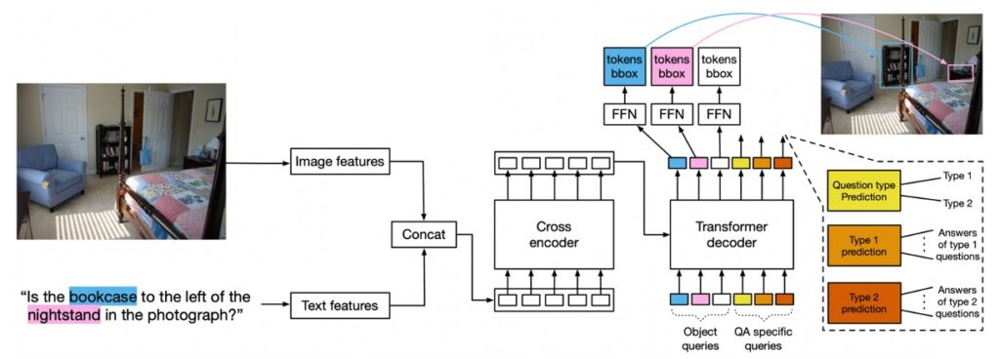

# [21.04] MDETR

## 連續之藝

[**MDETR -- Modulated Detection for End-to-End Multi-Modal Understanding**](https://arxiv.org/abs/2104.12763)

---

:::info
以下內容由 ChatGPT-4 彙整，並經過人工校對編輯與補充說明。
:::

---

在近年的電腦視覺領域，物件偵測一直站在前線，扮演著眾多先進多模態理解系統的核心角色。然而，傳統的方法將偵測系統作為一個黑盒子，進行固定概念的影像偵測，這樣的方法明顯受到了其固有局限性。

一個很明顯的問題，就是它不能有效地利用多模態上下文進行協同訓練，下游模型也只能存取已偵測到的對象。而且，這樣的偵測系統往往是凍結不變的，意味著它們缺乏進一步的細化和適應性。更重要的是，這些偵測系統的詞彙受到嚴重的限制，對於以自由格式文字表達的新穎概念組合通常是盲目的。

簡單來說，本論文的作者也想要把 VL 模型裡的物件偵測的架構換掉。

你應該還記得之前有一篇論文是用 ViT 來換，但結果沒有很好。

- 傳送門：**[ViLT：你方唱罷我登場](../2102-vilt/index.md)**

既然抽換 ViT 感覺不是很好（畢竟 ViT 不是專職用來做物件偵測的），所以這次就用另外一個「專職」做物件偵測模型，DETR，來進行抽換吧！

- 傳送門：**[DETR：跨領域的奠基者](../2005-detr/index.md)**

## 定義問題

目前大多數先進的多模態理解系統依賴於物件偵測作為其核心部分，但這些設計明顯充滿了各種問題：

1. **協同訓練的局限性**

   在多模態系統中，協同訓練意味著同時使用來自多種輸入源（例如：影像、文字、聲音等）的資料進行模型訓練。當一個系統的部分無法與其他部分進行這種協同訓練時，它可能無法充分利用所有可用的資訊。

   試想如果有一個影像和語音輸入的模型，只獨立地訓練影像偵測器而不考慮語音輸入，那麼當語音輸入提供有關影像中對象的重要資訊時，模型可能無法正確地識別該對象。

2. **偵測範圍的限制**

   偵測系統的主要目的是識別影像中的特定對象。但是，如果這些系統只專注於已知對象，並忽略了影像的其他部分，則可能會遺漏重要的上下文資訊。像是在一張含有多人和一隻狗的圖片中，偵測器可能只識別人和狗，但忽略了背景中的公園場景，這個場景可能提供了有關為什麼人和狗在那裡的重要資訊。

3. **模型固化**

   一旦模型訓練完成並「凍結」，它就不再更新或學習。這可能會阻礙模型在面對新的情境或資料時適應和優化。如果你的偵測器是在夏天的圖片上訓練的。如果它在冬天的圖片上不能進行微調，它可能會在雪地或穿著厚重外套的人上表現不佳。

4. **詞彙局限性**

   物件偵測系統基於其訓練資料識別特定的類別或屬性。如果遇到未在訓練資料中見過的新對象或概念，它可能無法識別。

5. **不是端對端的設計**

   端對端系統允許從輸入直接到輸出的連續學習和優化，沒有中間步驟。如果偵測器不是端對端的，那麼它和其他任務之間的協同訓練可能會受到限制。就數學上來說，這個系統無法微分呀，不能微分就沒機會優化啦！

## 解決問題

### MDETR 模型設計

這個模型很簡單，首先文字的部分，用改良後的 Encoder 模型， RoBERTa。

產出文字的特徵編碼之後，接著用 Concat 的方式，塞進原本的 DETR 架構。

整體結構分為幾個部分：

- **主幹卷積編碼**：圖像首先由卷積主幹編碼並攤平。
- **空間訊息**：透過將二維位置編碼加到攤平的向量中，模型保存了空間信息。
- **文字編碼**：使用預先訓練的 Transformer 語言模型對文字進行編碼，以產生與輸入大小相同的隱藏向量序列。
- **模態相關的線性投影**：對影像和文字特徵應用模態相關的線性投影，將這些特徵投影到一個共享的編碼空間。
- **交叉編碼器**：串聯影像和文字特徵的序列被饋送到一個聯合 Transformer Encoder，這是模型中的核心部分。

### 訓練方式

1. Soft token 預測

Soft token 的想法很有趣，soft token 關注於預測原始文本中對應於每個匹配物件的「範圍」，而不是預測每個檢測物件的分類類別。這是該方法與標準物件檢測的主要區別。

假設描述句子為「一隻黑貓和一隻白狗」，模型在檢測到黑色動物時，會試圖預測其與「黑貓」這部分文本的關聯性。這不是僅僅關於一個獨立的 Token 或類別標籤，而是關於文本中一系列的 Token，這些 Token 合在一起形成一個「範圍」，一起描述一個特定的物件。

這種方法的好處是它可以處理同一文本中對多個物件的多重引用，或者多個物件對應於同一文本的情況。

### 對比對齊

對比對齊旨在確保視覺對象的編碼表示與其相應的文本 Token 在特徵空間中是接近的。這種對齊比僅基於位置信息的”Soft token prediction”更強大，因為它直接運作在特徵表示上。

參考論文中所提供的數學式，其中：

- L：最大的 Token 數量。
- N：最大的物件數量。
- T+​i：給定物件 oi​ 應對齊的 Token 集合。
- Oi+​：與給定 Token ti​ 對齊的物件集合。
- τ：是溫度參數，直接設定為 0.07。

整個數學式的概念很簡單，意思就是：物件和文字，你們倆要好好對齊，長得愈像愈好。

### 所有損失

MDETR 的訓練涉及多個損失函數，除了上面提到的對比損失之外，還包括原本 DETR 論文中提到的那些損失，像是二分匹配的框預測損失、L1 loss、GIoU 等，都要一起算進來。

### 資料集

- **CLEVR**：用於評估方法的結果。
- **Flickr30k**：被用於建立組合資料集的影像。
- **MS COCO**：被用於建立組合資料集的影像。
- **Visual Genome (VG)**：被用於建立組合資料集的影像。
- 註釋資料來自於引用表達式資料集、VG 區域、Flickr 實體和 GQA 訓練平衡集。

### 技術細節

- **Pre-training Modulated Detection**

  預訓練階段，目標是檢測對齊的自由形式文字中引用的所有物件。

- **資料組合技巧與其重要性**

  - 對於每一張圖片，從所提到的資料集中取得其所有相關的文本註釋。若不同的註釋引用了相同的圖片，則這些註釋會被合併。為了保證訓練集和驗證/測試集的獨立性，所有出現在驗證或測試集中的圖像都從訓練集中移除。
  - 這種演算法用於組合句子，確保組合的短語或文字區塊之間的重疊不太大（GIoU ≤ 0.5）。GIoU 是一種用於評估兩個矩形區域重疊程度的指標。組合後的句子總長度被限制在 250 個字元以下。透過這種方法，形成了一個擁有 130 萬對齊的圖像-文字對的大資料集。
  - 使用這種資料組合技巧有兩個主要原因：
    - 資料效率：通過將更多的信息打包到單一的訓練樣本中，可以更有效地利用資料。
    - 更好的學習信號：
      - 當模型在學習時，需要識別和解決文本中多次出現的相同物件類別之間的歧義。
      - 在只有一個句子的情境中，「Soft Token 預測」的任務變得相對簡單，因為模型通常可以輕易地預測該句子的主題或核心意義，而無需太多依賴圖像。
      - 通過組合多個句子，模型被迫更加深入地探索圖像和文字之間的關聯，從而提高其預測能力。

- **模型架構選用**
  - 文字編碼器使用的是預先訓練的 RoBERTa-base，具有 12 個 Transformer 編碼器層。
  - 視覺主幹有兩種選擇：
    - **ResNet-101**：這是從 Torchvision 獲得的，並在 ImageNet 上預先訓練的。
    - **EfficientNet 系列**：使用了 EfficientNetB3 和 EfficientNetB5。其中 EfficientNetB3 在 ImageNet 上達到了 84.1% 的 top 1 準確率，而 EfficientNetB5 達到了 86.1%的準確率。
  - 另外也使用了一種基於大量未標記資料的訓練模型，這是使用 Noisy-Student 的偽標記技術。
  - 訓練的細節：使用 32 個 V100 GPU，進行了 40 個 epoch 的預訓練，有效批量大小為 64，訓練時間大約需要一周。

## 討論

### 下游任務表現分析

1. **Phrase grounding**

   

   作者使用了 Flickr30k 數據集和特定的訓練/驗證/測試分割。在進行評估時，他們採用了兩種不同的評估協議，這兩種評估協議都旨在解決當一個短語參考圖片中的多個物件時的問題，但它們採取了不同的方法，並具有各自的優點和缺點。

   1. **ANY-BOX-Protocol（任意協議）**

      在這個協議下，當給定的短語參考圖片中的多個不同的物件時，預測的邊界框被認為是正確的，只要它與任何一個真實的邊界框的交集超過聯合（IoU）大於預設閾值，通常是 0.5。這意味著只要模型能夠正確識別圖片中的任何一個參考物件，該預測就被認為是正確的。但此方法的問題在於，它無法評估模型是否找到了所有被參考的實例。

   2. **MERGED-BOXES-Protocol（合併框協議）**

      在這個協議下，如果一個短語參考圖片中的多個物件，那麼所有與該短語相關的真實邊界框首先會被合併成一個包含它們所有的最小邊界框。然後，如常規方法，使用這個合併後的邊界框作為真實的邊界框來計算 IoU。這意味著模型的預測需要與這個合併後的邊界框匹配，而不是與單獨的真實邊界框匹配。此方法的問題是它可能會失去對每個單獨實例的細緻了解，特別是當這些實例在圖片中相距很遠時，合併的框可能會不合理地太過巨大。

   3. **結果比較**
      - 在 ANY-BOX 設定下，與目前最先進的技術相比，MDETR 在驗證集上的 Recall@1 測量中取得了 8.5 點的提升，且不需要使用任何額外的預訓練數據。
      - 通過進行預訓練，使用相同的主幹網路，MDETR 在測試集上的最佳模型效能進一步提高了 12.1 點。

2. **Referring expression comprehension**

   

   大部分之前的研究和方法針對這項任務都是對一組預先提取的、與圖像相關的邊界框進行排序。這些邊界框是透過使用預先訓練好的對象檢測器得到的。

   相對於先前的方法，本文提出了更具挑戰性的目標：在給定引用表達式和相應的圖像下，直接訓練模型去預測邊界框，而不是簡單地排序預先提取的框。

   本文的模型在預訓練期間已被訓練以識別文本中所引用的每一個對象。例如：對於標題「穿著藍色連衣裙的女人站在玫瑰叢旁邊。」，模型會被訓練去預測所有引用的對象（如女人、藍色連衣裙和玫瑰叢）的框。然而，當涉及到引用表達式時，任務的目的僅僅是返回一個邊界框，代表整個表達式所引用的物件。為了適應這種變化，模型在這三個特定的資料集上進行了微調。

   上表中展示了結果，指出這種方法在所有的資料集上都比最新的方法有了顯著的進步。

3. **Visual Question Answering**

   

   這個模型架構也是可以應用到 VQA 的任務，但需要經過一些設計。

   - **模型設計**
     - 查詢類型：除了用於檢測的 100 個查詢之外，還引入了針對問題類型的查詢和用於預測問題類型的查詢。在 GQA 中，這些問題類型被定義為 REL、OBJ、GLOBAL、CAT 和 ATTR。
     - 訓練：進行了 40 個 epoch 的預訓練，然後在不平衡的 GQA 分割上微調 125 個 epoch，最後在平衡分割上進行了 10 個 epoch 的微調。
     - 損失策略: 在前 125 個 epoch 中，同時訓練檢測損失和 QA，但對 QA 損失給予更大的權重。

   模型利用物件查詢作為輸入到解碼器的學習編碼。這些編碼被用於物件檢測。在推理時，模型的特定部分會預測問題的類型並從該部分獲得答案。

   :::tip
   在這篇論文中，不是使用之前常見的 VQA v2，而是用 GQA。

   GQA 和 VQA v2 是兩個被廣泛使用於視覺問答（Visual Question Answering，簡稱 VQA）的資料集。儘管它們都著重於給定一張圖片並回答相關的問題，但這兩者有幾個關鍵的差異：

   1. **資料規模和來源**

      - GQA：GQA 資料集基於 Visual Genome 數據集，它包含大約 2200 萬個問題-答案對。
      - VQA v2：VQA v2 資料集是在原始 VQA 資料集上的改進，它包含大約 120 萬個問題-答案對，並基於 MS COCO 和 Abstract Scenes 數據集。

   2. **問題和答案的性質**

      - GQA：著重於複雜和組合的問題，通常涉及多個物件和其之間的關係。答案通常更具描述性，可以是多字的回答。
      - VQA v2：質量更加多樣，問題可以從非常簡單（例如：「這是什麼顏色？」）到較為複雜的問題。答案通常是一個或兩個詞。

   3. **資料不平衡性**

      - GQA：資料集的設計目的之一是解決 VQA 中的一些不平衡性問題，這些問題可能導致模型在沒有真正理解圖片內容的情況下猜測答案。
      - VQA v2：相較於其前身 VQA v1，VQA v2 特意加入了具有挑戰性的對照圖片，以解決原始資料集中的資料偏見問題。

   4. **場景圖**

      - GQA：GQA 包含了一個豐富的場景圖，詳細描述了圖片中物件的類型、屬性和它們之間的關係。
      - VQA v2：VQA v2 並沒有內建的場景圖，但研究者可以結合其他資料來源或技術來提供這些資訊。

   5. **任務的目的**
      - GQA：除了基本的視覺問答任務外，GQA 還著重於多模態推理，促使模型更加深入地理解圖片內容和問題的上下文。
      - VQA v2：主要著重於基本的視覺問答任務，旨在改進模型的性能並解決資料偏見問題。

   簡單來說，GQA 傾向於提供更複雜的問題和答案，並且具有更深入的物件和關係描述，而 VQA v2 則更加多樣化，著重於解決資料偏見問題。
   :::

4. **效能比較**

   

   - 使用具有 Resnet-101 主幹的模型，其表現優於 LXMERT 和 VL-T5。
   - 該模型的表現甚至超過了使用更多預訓練資料的 OSCAR。
   - 使用 EfficientNet-B5 主幹的 MDETR 模型可以達到更高的效能，詳見上表。

### Few-shot 可以做得到嗎？

作者們受到 CLIP 在 Zero-shot 影像分類的成功啟發，進一步探索了如何基於預訓練的 MDETR 模型在少量標記資料上進行物件偵測。不同於 CLIP，MDETR 的預訓練資料集不保證所有目標類別的平衡性。這意味著在其資料集中，沒有框是與文字對齊的，導致模型對於給定的文字，會始終預測一個框。

由於這種設計，MDETR 無法在真正的零樣本傳輸設定中被評估。因此，作者選擇了一個替代的策略，即在少樣本設定中進行評估。此次的實驗選擇了 LVIS 資料集，它包含了 1.2k 的類別，其中多數類別的訓練樣本非常少，呈現長尾分佈。

為了適應這種分佈，MDETR 的訓練策略是：對於每一個正類別，它採用圖像和該類別的文字名稱作為訓練實例，同時使用該類別的所有註解。而對於負類別，只提供類別名稱和空註解。在做推論時，MDETR 會對每一個可能的類別名稱進行查詢，然後合併所有文字提示上偵測到的框。

:::tip
舉個例子：

假設我們有一個簡單的資料集，只有三個類別：「狗」、「貓」和「魚」。

我們手上的標記資料如下：

一張圖片顯示一隻狗，標籤是「狗」。
另一張圖片顯示一隻貓和一條魚，標籤分別是「貓」和「魚」。
基於 MDETR 的訓練策略：

對於第一張圖片：

因為圖片裡有「狗」，所以將該圖片和文字「狗」作為訓練實例，並使用「狗」這個標籤。
由於圖片中沒有「貓」和「魚」，我們會提供「貓」和「魚」這兩個類別名稱，但是不會提供標籤（即空標籤）。
對於第二張圖片：

因為圖片裡有「貓」和「魚」，所以將該圖片、文字「貓」和「魚」作為訓練實例，並使用對應的標籤「貓」和「魚」。
由於圖片中沒有「狗」，我們會提供「狗」這個類別名稱，但不會提供標籤（即空標籤）。
當 MDETR 進行推論時，對於一個新圖片，它會分別查詢三個類別名稱「狗」、「貓」和「魚」，並合併在每個文字提示上偵測到的結果。例如：如果它在查詢「狗」時偵測到一個框，在查詢「貓」時沒有偵測到框，而在查詢「魚」時偵測到一個框，則最終的結果將包含一個「狗」的框和一個「魚」的框。
:::

作者在 LVIS 資料集的三個子集（包括 1%、10%和 100%的影像）上進行了 MDETR 的微調。結果與兩個基線方法進行了比較：一個是直接在 LVIS 的完整訓練集上訓練的 Mask-RCNN，另一個是先在 MSCOCO 上預訓練，再在 LVIS 的子集上微調的 DETR。令人驚訝的是，即使在只有 1% 的資料上，MDETR 都能利用它的文字預訓練，在稀有類別上超越完全微調的 DETR。

此外，有一個顯著的觀察是：當在全部的訓練資料上進行微調時，對於稀有的物體偵測表現從使用 10% 的資料的 20.9 AP 驟降到使用 100% 的資料的 7.5 AP。這一大幅下降可能是由於資料中的極端類別不平衡造成的。

## 結論

MDETR 最吸引人的特點之一就是它的「完全可微性」。

這種設計讓整個模型可以進行端到端的訓練，這種一致性帶來的效果是：更緊密的模型協同工作，進而有機會提高整體性能和訓練效率。其次，在實際的性能表現上，它在多種資料集上都展現出了令人難以置信的效果，這使得它在多模態學習的領域中站穩了腳跟。

再者，MDETR 的多功能性也是一大亮點。它不僅在調製檢測上展現出色，還在其他如 Few-show 偵測和視覺問答等下游應用中證明了自己的價值。

MDETR 提供了一條道路，在其不依賴黑盒物件偵測器的設計思路可能會啟發更多的研究者去創建準確且高效的模型。

:::tip
為什麼以前的論文架構不也把 Faster RCNN 都串起來呢？完全可微分，多好？

因為完全可微的模型雖然聽起來很美好，但它也可能需要更多的計算資源。特別是當你沒有經過一些巧妙的設計，就單純地、直接地、暴力地串串串的時候，你很大的概率會受到來自模型對你的制裁：

- **Train 不起來。**

當整個模型都是可微的時，其內部結構很可能複雜，這也意味著更高的計算成本和更多的訓練難度。研究人員可能需要花更多時間進行調參，而這可能不是每個團隊都能夠承受的。
:::
