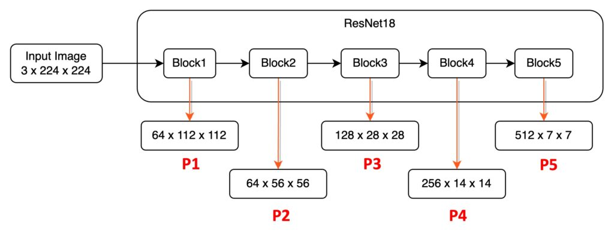
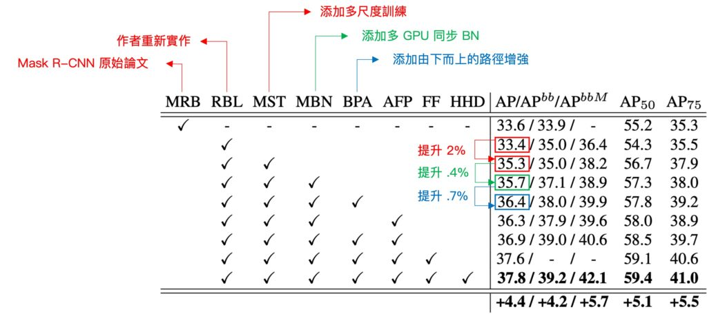

# PANet

## 給我一條捷徑

**[Path Aggregation Network for Instance Segmentation (2018.03)](https://arxiv.org/abs/1803.01534v4)**

---

:::info
以下內容由 ChatGPT-4 彙整，並經過人工校對編輯與補充說明。
:::

---

在經典款的 FPN 提出來後，「該如何用更高效的方式進行特徵融合？」成為一門待研究的課題。

我們來看看另外一個同樣是很經典的架構 —— PANet。

## 定義問題

在 PANet 的論文中，主要比較的對象就是 FPN 架構，若您還不熟悉，可以參閱：

- **傳送門： [FPN：金字塔架構](./fpn)**

回想一下之前我們在 FPN 得到的一個小結論：「下到上，上到下，然後加起來。」

對於這個設計，PANet 認為是不夠的，以下是來自於論文作者的論述：

>The insightful point that neurons in high layers strongly respond to entire objects while other neurons are more likely to be activated by local texture and patterns manifests the necessity of augmenting a top-down path to propagate semantically strong features and enhance all features with reasonable classification capability in FPN.
>
> Excerpted from PANet

我認為上面這段敘述如果直接翻譯成中文，就失去了原來的美感，所以還是選擇把他留下來。簡單來說，頂層的神經元可以看到整個物體，底層神經元可以看到局部紋理，所以我們不能只有一條融合特徵的路徑，要再多給一點。

這段話已經把全文的核心功能都講完了。

我們搭配圖來看，將這段話拆開來看一下，首先是 neurons in high layers，指的是 Block5。這一層的神經元的感受野（Receptive Field）非常廣，他們能關注到較大的物件。其他的比較低層的特徵，例如 P1, P2 等，則是會關注 local texture and patterns（局部特徵和紋理）。

原本的 FPN 的設計，讓底層（例如P1）能夠參考高層的特徵（例如P5）——  以一個很短的路徑，可能只有數個或數十個卷積層。但高層（例如P5）若要參考底層（例如P1）的資訊的話，則可能需要數百層卷積 ——  基於選用的骨幹網路。

也差太多了吧，是不是應該要改一改？

## 解決問題

### PANet 模型設計

如上圖，這就是作者提出來的改善方式。首先是圖 (a)，這是我們之前提到過的 FPN 架構。接著是圖 (b)，這是作者加上的路徑，概念上就是：覺得原本路徑太長（圖上的紅線），那就給他一條從下到上的捷徑（圖上的綠線）。圖 (c) 和 圖 (d) 已經屬於 Head 的結構，這不在我們這次的討論範圍，就先略過不提。

### 路徑聚合網路（Path Aggregation FPN）

最後我們仔細講一下路徑聚合模組的實作方式：每個構建塊的做法是，我們把來自較底層的特徵圖（Ni）和高一層的特徵圖（Pi+1）放在一起，然後製作一個新的特徵圖（Ni+1）。

對於每個特徵圖（Ni），首先使用一種 3×3 大小的卷積運算，搭配 stride=2，它會把圖片的空間尺寸縮小一半，好讓我們處理更少的資料。需要注意的是，圖 1 中的 N2 只是 P2，沒有進行任何處理。

接著，把特徵圖（Pi+1）中的每個小方塊，跟尺寸變小的特徵圖（Ni）對應位置的小方塊相加。最後，我們再用另一種3×3的卷積運算處理這個結合後的特徵圖，這樣就得到了供後續子網絡使用的新特徵圖（Ni+1）。

整個過程是重複進行的，直到接近最頂層的特徵圖（P5）就停止。在這些構建塊中，PANet 保持特徵圖的通道數為 256，而且每個卷積運算後都會加上 ReLU 的激活函數，作者認為這可以讓模型學習到更有用的特徵。

最後，從這些新生成的特徵映射中，把每個提案的特徵網格結合在一起，這些特徵網格就是上圖中的 [N2，N3，N4，N5]。通過這樣的方式，PANet 架構不僅保留了特徵的重要性，還有效地增強了信息的流動，為後續的任務奠定了堅實的基礎。

## 討論

### 比起基本的 FPN 如何？

當我們深入了解這個架構時，可以看到作者在優化過程中進行了不少的分析和實驗。

讓我們一起來看看其中的一些亮點。

首先，聚焦在「多尺度訓練」這個元素，也就是圖中的「MST」。

這裡就是之前提到的 FPN 的架構實作，可以看到當加入這個元素的時候，可以讓原本的模型表現 AP 分數提升 2%。

接著作者加入了「多 GPU 的 BatchNorm」這個元素，先基於原本的多尺度架構上再提升 0.4%，再來就是本論文中強調的「自下而上的路徑增強」這個關鍵元素，也就是上圖中的 「BPA」。這個方法的核心理念是從底部開始，通過將較低層次的特徵圖與高層次的特徵圖結合，建立起一個更豐富的信息層次結構。

加入了「BPA」之後，可以將模型表現再次提升 0.7%，這邊我們覺得這個消融實驗有點可惜，在「MST」和「BPA」之間被插入了一組「MBN」的元素，因此沒能更直觀地看出單純的「MST」和「MST+BPA」的對比。

除了「自下而上的路徑增強」，作者還引入了一些其他關鍵元素，讓整個架構更加強大。雖然這些是屬於 Model Head 的部分，不是本文的重點，不過既然圖表都放上來了，這邊就簡單帶過過一些資訊。

其中一個是「自適應特徵池」，這個技術的作用是將特徵網格和所有特徵級別進行連接，使每個特徵級別中的有用信息能夠直接傳播到後續的子網絡。這種方式讓不同層次的特徵可以更好地合作，進一步增強模型的表現。另外，「全連接融合」也是一個重要的部分。通過這種方法，作者致力於提高模型的預測質量，從而改善整體的性能。

## 結論

PANet 延續了 FPN 的設計理念，繼續探索如何更好地解決多尺度的特徵融合問題，同時在此基礎上進行了更進一步的創新。這個架構不僅能夠有效地結合各種主幹網絡，構建出更強大的特徵金字塔，更能夠為多尺度的任務提供優越的性能改進。

PANet 的論文向我們傳遞了兩個重要的信息：

首先，無論我們面對怎樣的多尺度問題，都必須考慮如何進行特徵融合。PANet 的設計概念中充滿了對不同尺度特徵的關注，並通過路徑的增強以及特徵池和融合的方式，將這些尺度融合成一個強大的特徵表示。

其次，有別於之前 FPN 提到的：「下 –> 上，上 –> 下，然後相加。」；在 PANet 中，作者認為要改成 「下 –> 上，上 –> 下，下 –> 上，然後相加。」。

在探索特徵融合的過程中，還存在著一系列有待解決的問題，例如加法融合與連接融合的比較、融合效率的提升，以及融合權重的調整等。這些議題將在未來的研究中進一步探討。
